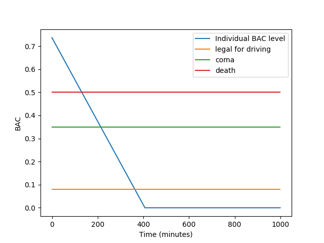
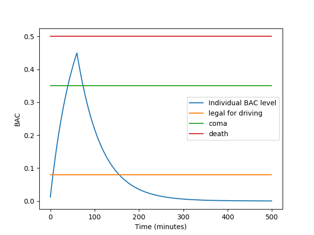
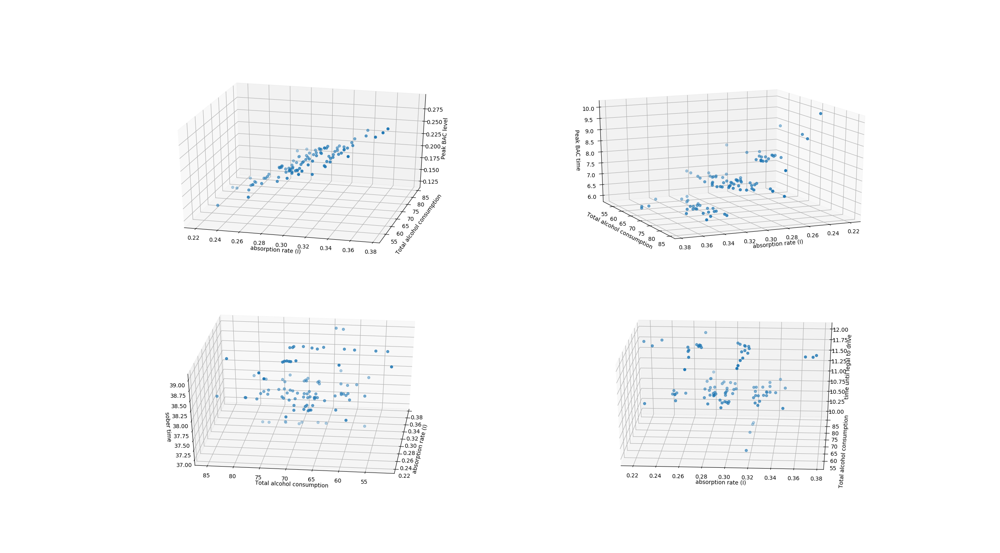

# BAC_prediction
Time-varying model for Blood Alcohol Level(BAC) prediction.

## Abstract
Alcoholic beverages are consumed largely for their physiological and psychological effects, but they are often consumed within specific social contexts and may even be a part of religious practices. Because of the effects that alcohol has on the body and on behaviour, governments often regulate its use. A big concern that many people have is how long the alcohol they have been drinking will remain in their system. Drinking heavily puts people at risk for many adverse consequences, including disorientation, coma, or even death. But some people appear to be at greater risk than others for suffering from these problems. In this project, we construct time-dependent mathematical models to interpret this process. 

## Prerequisite
- [Numpy](http://www.numpy.org/) should be installed for model computation.
- [matplotlib](https://matplotlib.org/) should be installed for graphics and visualization.

## Getting Ready
Our python file takes in command line input arguments, so you will need to use [terminal](https://www.youtube.com/watch?v=8sLgu_q5Jyk) for full functionality.
Open a terminal, redirect to your work space. Then, clone this repository
```sh
git clone https://github.com/stwklu/BAC_prediction.git
```
Redirect into the repository
```sh
cd BAC_prediction
```
Give permission to execute the code
```sh
chmod u+x bac.py
```
Now the model is ready for use.

## Usage
Note that there is no explicit way to set model parameter via command line. Hence for reasonable result you should set the parameters inside the python file before executing the following commands.
- To replicate **Example 1 Discrete Model**
  ```sh
  ./bac.py discrete
  ```
  Using the parameter specified in report, you should obtain a graph looking like this
  <p align="center">
    
  </p>

- To replicate **Example 1 Discrete Model**
  ```sh
  ./bac.py continuous
  ```
    Using the parameter specified in report, you should obtain a graph looking like this
    <p align="center">
      
    </p>

- To replicate scatter plot **figure 1**
  ```sh
  ./bac.py scatter
  ```
  Using the parameter specified in report, you should obtain a graph looking like this
  <p align="center">
    
  </p>

- To do all of above, simply
  ```sh
  ./bac.py
  ```
   
 ## Ackknoledgement
This project is intended for obtaining credit in MATH 372 at University of Alberta. We thank Dr.Hassan Safouhi* for providing the initiative of the project as well as the methods we need to address the problems.
